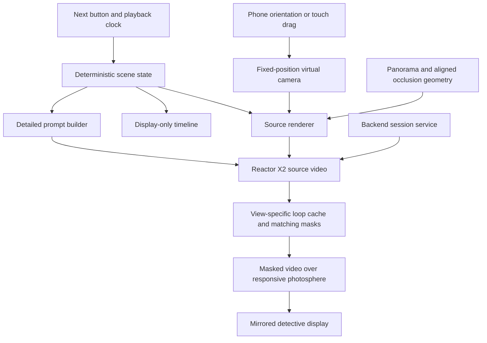

> **Two authors.** Part A — from the next heading down to "Part B" — was written by
> Jack's agent (`053de48`, revised in `14fffa9`); Zeus has not edited it. Part B
> (decisions and live test results) and Part C (reconciled plan, pending Jack's
> sign-off) were added by Zeus, Atilade's planning agent, on 12 Sep 2026.

# WITNESS architecture

Status: proposed architecture based on the agreed demo scope. This document does
not imply that the generation pipeline is implemented. Unresolved choices are
listed at the end.

## Demo scope

Extend the fixed-view experience described in [PRODUCT.md](PRODUCT.md): Chrome
on a Google Pixel 7, held upright, with phone rotation controlling the viewing
direction outside Bastille Court. Touch dragging remains the fallback. Display
the generated view on the phone and mirror it to the detective's screen.

The demo uses hardcoded scene steps triggered by a Next button. Each step adds
or corrects an object at a predefined position. A looping animation controls scripted movement. A bottom timeline shows
progress and events only; it has no scrubbing or seeking. Speech-driven placement is outside this
initial scope. Each step waits for Next while its animation loops. X2 is the
only generation path; no alternative model or rendered-object fallback is planned.

Keep the photographed surroundings and lighting unchanged. Added cars, people,
animals and similar objects use distinct labelled 3D bounding volumes as generation guides.
Accurate object placement is the primary success criterion.

## Core approach

Maintain a small, deterministic 3D scene over a panoramic background. Render
the current camera view, including the labelled boxes and their occlusion, and
stream that composite into Reactor X2. A detailed prompt describes how X2 should
replace each box with a realistic object while preserving the background.

The source scene is 3D; the generated output is a 2D video of its current view.
Turning the phone rotates the source camera and supplies new frames. This does
not require generating an editable, photorealistic 3D world or supporting
physical walking through it.

## Scene state and timeline

Use one shared scene definition for rendering, prompts and playback. It contains:

- Panorama asset, fixed camera origin, orientation alignment and ground scale.
- Stable object IDs, semantic labels, dimensions, position, rotation and visibility.
- Object descriptions such as vehicle type, colour, clothing and facing direction.
- Predefined motion paths and speed or timing information.
- Scripted additions and corrections, each associated with a demo step.
- Static geometry and masks used to hide objects behind photographed features.

Keep the current story step, playback time and camera orientation separate.
Evaluate transforms directly from playback time so looping produces the same
source scene. The timeline is an indicator, not an input. A correction updates the same object
ID; it does not rebuild the street. Preserve corrections across animation loops; restarting the full demo restores
the initial revision.

Positions and paths come from the authored scene, not from instructions asking
X2 to invent movement. For example, the car's box follows a predefined trajectory
and X2 receives frames already containing its movement and perspective.

## Panorama alignment and occlusion

A panorama supplies colour but does not automatically provide the geometry
needed to place objects behind photographed buildings, trees or bicycles.

Recommended demo implementation: manually align a ground plane and simple
invisible surfaces to the chosen panorama. Use building surfaces for large
occluders and more detailed silhouettes or depth masks for foreground features.
Render boxes with depth testing against these surfaces while retaining the
panorama's appearance. A person behind the photographed bike must have the
appropriate parts of their box hidden before the frame reaches X2.

Calibrate the panorama heading, camera height, ground plane and object scale
using visible landmarks. From a single photograph these measurements are
estimates; visual alignment is not a surveyed reconstruction.

Use Mapbox where available to establish rough building volumes near the
photosphere GPS coordinates. Read latitude and longitude from the original
image metadata, validate them, and convert nearby geometry into a local frame
centred on the camera. GPS gives approximate location, not panorama heading,
camera height or precise image alignment. Inspect orientation metadata when
present, then calibrate against visible landmarks. Mapbox does not provide the
bike, fence and tree detail needed here; foreground masks remain necessary.
Validate local coverage and supported geometry access before integration. See
[Mapbox's 3D building example](https://docs.mapbox.com/mapbox-gl-js/example/3d-buildings/).

## Reactor X2 integration

X2 accepts a source video stream and editing instructions and returns a
transformed video stream. It supports prompt changes during a session; changes
take effect at generated block boundaries. See the
[X2 overview](https://docs.reactor.inc/model-api-reference/x2/overview).

The browser renderer should produce a capturable video source containing the
panorama and guides, excluding controls, the timeline and the debug toggle. Verify that the chosen
imagery delivery and renderer support capture; a separately embedded panorama
viewer cannot simply be assumed capturable.

Generate a long, specific prompt from a stable template and the active scene
state, reflecting the team's practical experience with X2. Include:

- Background preservation, camera perspective and existing lighting.
- The mapping from each visible box label to its object description.
- Desired scale, facing direction and visible appearance.
- Instructions to follow source motion and preserve visible occlusion.
- Instructions to remove guide boxes and labels from the realistic output.

Object IDs remain authoritative in scene data. Visible labels are visual cues,
not a documented structured object-control channel. Test whether labels help
X2 distinguish boxes or leak into the output. Use distinct guide colours and descriptions to distinguish objects, especially
when they overlap.

Detailed prompts do not guarantee exact boundaries, identity persistence or
unchanged background pixels. Those are acceptance criteria to measure, not
capabilities to assume. The deterministic source render is the placement
reference. Do not assume a fixed generation seed solves consistency.

## Bounding volumes and debug display

Viewer-facing bounds are very subtle, translucent and slightly holographic,
showing approximate 3D shape and distance. A top-right Debug button toggles these
bounds; default them off. This changes only their display visibility, preserving
scene state and model guidance. Keep model-facing guides clear enough to
condition generation independently of the faint debug styling.

The intended object occupies its authored volume. Generation should appear
inside its projected bounds. Prompting is not a hard spatial constraint:
the agreed approach is to composite generated video over the original
photosphere only within visible projected object masks, keeping original pixels
elsewhere. Allow a small configurable margin and softened edges around each
projected box; apply foreground occlusion after expanding the mask. A larger
margin may reveal altered background. Cropping cannot relocate an object that
X2 generated outside its guide. Test edge quality,
clipped objects and restricted shadows before accepting this technique.

This requires matching returned frames to source camera and object state.
Current-camera masks over delayed video misalign as the phone turns. Establish
frame/state correspondence or hold a matched presentation state before claiming
strict containment. This is a validation requirement, not a verified X2 masking
capability.

## Sessions, playback and latency

Proposed backend responsibility: mint browser session credentials, retain the
scene revision and demo state, and coordinate the mirrored display. Keep
long-lived API credentials server-side. Modal can host this service; Reactor
hosts X2, so this proposal does not require serving X2 weights on Modal.

Keep one generation session active where practical. Associate scene edits with
local revision IDs and update the source and prompt together. These IDs track
application state; they do not establish exact correspondence with returned
frames unless the API provides suitable timing metadata.

Measure phone-motion-to-output and edit-to-output delay on the actual Pixel 7.
Model frame rate alone is not end-to-end latency. Show measured values if the
demo displays latency. Slow camera motion is the starting assumption.

The timeline displays elapsed animation time and event markers without seek
interaction. Next advances hardcoded scene steps; the playback clock drives
movement and loops. Test generation across loop boundaries: identical source
frames do not guarantee identical generated output.

## View-specific generation cache

Generate a complete animation cycle for a stable viewing direction, then cache
and replay the same X2 video with its matching masks. Each story step waits for
Next and loops its cached animation; the display-only timeline follows replay
time. Cache replay prevents fresh generation drift on every cycle, but does not
make the first and last frames seamless. Select and validate a suitable loop
boundary, especially for standing people or other continuously visible objects.

Key each cache entry by photosphere/calibration revision, scene step and
correction revision, camera orientation and field of view, output dimensions,
animation definition and generation settings. Store the generated clip, matching
mask sequence or reproducible aligned mask state, and loop timing together.
A correction invalidates affected scene entries. Keep cache size bounded on the
phone; returning to an evicted direction may require fresh generation.

Start with one stable direction; multiple direction entries can be added as the
user explores. A cached clip is valid only for its matching view. Do not stretch
or paste it onto another direction and assume perspective remains correct.

When the phone moves outside a cached view, immediately rotate the original
photosphere, hide unmatched generated layers and show a brief "Updating
reconstruction" status. The user has explicitly accepted this interval. Once
the direction settles, generate for that view; reveal the object layer when its
video and masks align. Reuse a valid cached loop when the user returns to that
view. Supersede obsolete view requests when the phone moves again, so late
results never replace the current view. Changes in pitch and field of view
matter as well as heading.

Do not restart generation on every sensor sample. Determine the settling and
view-match tolerances through testing. Keep debug bounds tied to the displayed
state, and distinguish updating from cached replay. New directions and scene
corrections still use X2; no generation fallback is authorised.

Caching does not solve source/output timing alignment. Verify how a returned
frame maps to source animation time before storing its masks. Holding a stable
camera removes camera mismatch but not moving-object timing mismatch.

## Background source

Use the user's own Google Pixel 7 photosphere directly, replacing Google Street
View imagery in this proposed pipeline. Host the original asset with the project
and render it as the fixed panoramic background. No street-imagery API is needed
for the background. Preserve original metadata before image optimisation.

Inspect GPS and photosphere projection, crop and orientation metadata on import.
Validate full-sphere versus cropped coverage rather than assuming a 2:1 image.
If GPS is absent, record a manually supplied camera location; if heading is
absent, calibrate against landmarks. Do not infer coordinates from the earlier
Street View screenshot.

The original photosphere asset and GPS metadata have not yet been verified in
this checkout. Source choice is settled; asset discovery and calibration remain
implementation prerequisites. Mapbox supplies geographic context and rough
geometry, not replacement background imagery.

## First validation slice

Before building the full story, test one stationary box, one moving box and one
box passing behind a foreground feature, using the actual phone viewpoint.
Compare the generated output with the source for position, scale, occlusion,
background drift and orientation delay. Then correct an existing object's
colour and facing direction while holding the camera fixed.

Test looping, cache reuse, correction invalidation, direction changes, timeline
progress and the debug toggle separately. Refine X2 guides, prompts and mask
alignment if placement fails; report unresolved failures without switching to
another model or directly rendered replacement objects.

The van reveal also needs a geometry test: rotating a symmetric rectangular box
180 degrees does not uncover a doorway. The scripted camera or object placement
must actually change visibility. Any hidden person in the fictional demo must
be authored explicitly; generated details are not recovered evidence.

## Remaining validation

- Locate the original photosphere and verify GPS, projection and orientation metadata.
- Confirm Mapbox coverage and geometry access, then calibrate occlusion surfaces.
- Verify X2 follows labelled volumes and preserves object identity.
- Validate frame alignment and compositing for strict box containment.
- Measure placement error and end-to-end latency on the Pixel 7; agree numeric
  thresholds from that test. Accurate placement remains the priority.

This revision updates the architecture only. It does not implement the panorama
migration, UI changes or map integration, or install new dependencies.

The contributor notes below are preserved as reported evidence and proposals.
Part A above reflects the latest user decisions: owned Pixel 7 photosphere,
Mapbox-assisted alignment where feasible, display-only timeline without
scrubbing, and subtle bounds controlled by a top-right debug toggle. Older
scrubbing references below are superseded. The latest decision also supersedes
all fallback recommendations below: X2 is the only generation path. Preserve
those historical test results as evidence, not as implementation authorisation. Reported model tests and prompt
limits below still need to inform implementation and validation.

---

# Part B — Zeus additions

> **Author: Zeus** (Atilade's planning agent), added 12 Sep 2026 from ~13:30 and updated ~13:45.
> Everything above this line is Part A, originally written by Jack's agent in `053de48` and
> since revised by Jack's agent (`14fffa9`) to reflect the latest user decisions; Zeus has not
> edited it. Part B records what Atilade and Zeus decided, what has been measured on the live
> APIs, and answers to Part A's open points. Part C proposes how the two fit together; it needs
> Jack's agreement before it is treated as settled.

## B1. End goal

WITNESS: an interviewer rebuilds a hit-and-run from a witness's statement, on the real street
outside Bastille Court, and the scene can be argued with. The **correction** (the van was not
white, it was dark and facing the other way) is the moment that proves the product: one object
changes and the rest of the street holds.

- **Prizes we are building for:** Real-Time Interactive (Reactor, £1000 + $2K credits) and Best
  Use of World Models (£1000).
- **How it is judged:** judges come to the table from 17:45 for 2–3 minutes and score four
  things: use of world models ("is the model doing the work?"), ambition, execution ("does it
  run in front of a judge, today?") and craft. Submissions close **17:30**.
- **Pitch line for the Reactor judge:** their own three words — *realtime* (the view answers
  the phone and the statement), *persistent state* (the street survives a correction),
  *controllable* (every object sits where the interviewer put it).

## B2. Decisions made with Atilade

| # | Decision | Why |
|---|---|---|
| 1 | **The live build is the demo; a recorded video is the submission and the backup.** | Judging scores live execution. An earlier storyboard said "record only"; that is reversed. |
| 2 | **Daytime, overcast, wet ground after rain. No falling rain.** A lamp post can be a landmark but has no story role. | World models hold daylight far better than night, rain and reflections. |
| 3 | **The world only shows what the witness said.** The doorway stays empty until she says "there was someone else"; only then is the figure added, as an authored object. | Showing her something she never said is how false memories are planted. Agrees with Part A: "Any hidden person … must be authored explicitly." |
| 4 | **The impact happens off screen:** a screech and a thud on the audio, then the aftermath (a shopping bag on the wet road). | Reactor moderates violent content in prompts *and* images and **terminates the session** when flagged (docs: Content Moderation). A flagged prompt at the table kills the demo. |
| 5 | **No violent words in anything sent to Reactor** ("hit", "victim", "body", "blood", "injured"…). The prompt builder filters them; the on-screen transcript can say anything. | Same as 4. |
| 6 | **Faces small, distant, in shade. No readable text** (plates, signs, shop names). | Generated faces and text are unstable. |
| 7 | **Guide-driven generation:** the model only fills guides the interviewer placed. | From Part A; agreed. It keeps placement deterministic and keeps decision 3 honest. See B4 for what the model-facing guides should look like. |
| 8 | **Background from imagery we own.** Part A now settles this as Atilade's Pixel 7 photosphere. | Street View's terms restrict derivative content, and its Static API image is too small anyway. |
| 9 | **Witness work runs on its own hub board** (`HUB_DIR=~/hub-witness`), separate from Refinery. | Atilade's instruction. |
| 10 | **No free-drawing 2D box editor.** Task T-001 was cancelled at 13:30 and the Prometheus-w worker shut down. | Part A drives the demo from scripted steps, so the editor was off the critical path. |
| 11 | **No Runware.** The team's `WMHACK26` code does not work, so nothing in the plan depends on it. | The only use was filling guides for the LingBot fallback; X2 now does that (B5). |

## B3. What has been measured (live APIs, 13:00–13:45)

| Check | Result |
|---|---|
| Reactor API key | Works. Mints session-scoped tokens. |
| Model access | `lingbot-world-2` ✅. X2 ✅ **only as `xmax/x2`** — the slug `x2` shown in some docs is rejected ("requested model is not available to this API key"). |
| **LingBot correction test** (re-anchor on an image that differs in one box: `reset → set_image → set_seed → set_prompt → start`, same session) | Correction lands in **~3.7 s** (reset 0.1 s, upload + conditioning 2.7 s, first frame 0.9 s). Mean pixel change: **28.9 inside the edited box, 2.6 outside** — less than the street's own drift over 4 s with no edit (10.2). The street holds. |
| **X2 test 1: black box labelled VAN** (still street frame streamed to `source` at 24 fps; "replace the box with a white van… remove the box and label… preserve the street", then "navy van") | **Fast:** first edited frame 0.6 s after the prompt, steady 24 fps. **Failed:** the van appeared across the middle of the street, not in the box; **the "VAN" label leaked** into the output; the street moved (19.1 outside the box); the dog vanished, then reappeared doubled. |
| **X2 test 2: grey van-shaped silhouette, no text** (same street; stage 1 guide only; stage 2 + a side-on reference photo of a white panel van; stage 3 prompt changed to navy) | **Much better.** Guide only: a real vehicle appears **roughly where the guide is**, side-on, but it is a minivan and spills ~20% past the guide. With the reference: **the right vehicle, a panel van matching the reference**, in the same place. **Correction: the van turns navy (reads slightly purple) and keeps its shape and position.** Artefacts: a leftover white panel and a small extra car at the guide's right end, because the guide was longer than the reference van. Visually the houses, tree, hydrant and skyline hold; measured change outside the guide ~16–17, inflated by the van spilling past the guide and by X2 re-rendering the whole frame. |
| **Fallback without Runware: X2 as the inpainter** (the X2 van pasted into the original photo inside a feathered object mask → LingBot reference; correction = paste the navy X2 van and re-anchor, same session) | **Works.** The correction lands in **6.4 s**. Change between the live white and navy worlds: **48.2 inside the mask, 4.5 outside** — the van changes, the street, dog, tree and hydrant stay put. The small extra car and panel edge from X2 test 2 were carried over by the paste; a properly proportioned guide or a tighter mask removes them. |
| **Capacity** | At 13:38 LingBot refused a session: **429 "no available capacity: no available servers"** (the whole hackathon shares these GPUs). X2 connected at 13:40 (ready in 5.8 s); LingBot capacity was back by 13:40. Capacity at 17:45 is not guaranteed for either model. |
| Reactor limits | 5 concurrent sessions, 10 new sessions/min (burst 3). Tokens last 1 h by default — mint a fresh one before 17:45. |
| Cost | Billed per second from `ready` until disconnect, generating or not. LingBot $0.42/min (~$25/h). X2 is private preview, price unpublished. **Disconnect idle sessions.** |
| Recording | `requestRecording()` returns the whole session as an MP4 (kept 24 h). Useful footage for the submission video. |

All frames are in `docs/evidence/`; the scripts that produced them are in `scripts/spikes/`.
Each result is one run on a stand-in street photo, not the venue — evidence, not a verdict.

## B4. Answers to Part A's open points

| Part A point | Zeus's answer |
|---|---|
| Background source | Settled in Part A (Pixel 7 photosphere). Agreed. |
| Manually authored geometry and occlusion masks | Accept, but keep it to what the story needs: the ground plane, the van, the doorway, and one foreground occluder at most. |
| Timeline and loops | Settled in Part A (display-only timeline, corrections persist across loops). Agreed; earlier scrubber notes are superseded. |
| Placement tolerance and latency | Targets: correction visible in under ~5 s on X2 (under ~7 s on the fallback); phone rotation to output under ~1 s. Measure on the Pixel 7. |
| **"Verify X2 follows labelled volumes"** | Tested (B3). **Labels drawn in the frame leak into the output** and a plain box does not hold placement (test 1). **Object-shaped grey guides with no text do much better**, especially with a reference image (test 2). Recommended model-facing guide: a flat silhouette of the object's side or rear profile, **proportioned like the reference object**, perspective-correct from the renderer, **no text in the frame** — keep labels in scene data and the prompt. Distinct guide colours per object (Part A) are untested; worth one run. |
| **Composite generated video only inside projected masks** (Part A, new) | Strongly endorsed, and the fallback test (B3) is a working example of the same idea on a still frame. It removes the spill past the guide, the leftover panel and the background drift, and keeps the real photosphere everywhere else. Part A's own caveat is the risk: the mask must match the frame X2 returns, not the current camera. Holding the camera still during a correction sidesteps it for the key beat. |

Further notes on Part A:
- **X2 prompts are capped at 1000 characters**, and X2's prompt guide advises the *shortest*
  instruction that names the target, the one change, the spatial relationship and what to
  preserve — not a long description of the scene the source already shows. The prompt that
  worked in test 2: *"Turn the flat grey van-shaped silhouette on the right side of the road into
  the van from the reference image, parked exactly there at the same size, side-on to the camera.
  Keep everything else unchanged: street, houses, tree, hydrant, dog, light and camera."*
- X2 takes **one reference image** per session, and swapping it restarts the stream. Give it to
  the object that matters most (the van); the other objects rely on their guide shape and the
  prompt.
- X2 animates what it sees, even from a still source (the dog moved in both tests). Anything that
  must stay still should be described as still in the prompt.

## B5. Zeus's fallback path: X2 fills, LingBot holds

Built and measured as a backup, with no Runware: take an X2 output frame of the current view →
paste the object into the original photo **only inside its projected mask** → the result
becomes LingBot World 2's reference image → a live world the phone can look around. A
correction pastes the corrected X2 frame and re-anchors in the same session (B3: 6.4 s; 48.2
change inside the mask, 4.5 outside). It needs X2 and LingBot capacity at the same time.

Its limits, stated plainly: the world grows from one image, so turning far past that image makes
the model invent the rest; and it cannot follow authored motion paths the way Part A's source
render can.

---

# Part C — Reconciled plan (proposal, needs Jack's sign-off)

> **Author: Zeus.** Keeps Part A's architecture as the target and says what gets built in the
> time left.

## C1. One scene, two outputs

Part A's scene state (stable object IDs, labels, descriptions, transforms) is the single source
of truth. Labels live in the scene data and the prompt, **not drawn in the model-facing frame**
(B4). Its source renderer produces:

1. the **model-facing composite** (photosphere + object-shaped guides + occlusion), streamed to
   X2 via `canvas.captureStream(24)` — the primary path;
2. the **projected object masks** Part A already needs for compositing X2's output back over the
   photosphere; and
3. on request, the clean background frame, which with those masks and one X2 frame is exactly
   what the LingBot fallback needs.

The viewer-facing debug bounds (faint, off by default) stay separate from the model-facing
guides, as Part A says. The prompt builder reads the same scene state for both paths, applies
the moderation filter (B2 #5), and stays under X2's 1000-character limit.

## C2. Recommendation

**Build Part A on X2 as the primary path**, with object-shaped guides (no text in the frame), a
reference image for the van, and Part A's mask compositing. Reasons:

1. X2 test 2 put the right van in the right place and kept it there through the navy correction.
2. Part A's mask compositing addresses the artefacts that test showed.
3. It keeps the phone view, authored motion (the moving car) and occlusion, which the LingBot
   path cannot do.
4. It needs one model, not two. When LingBot ran out of capacity at 13:38, X2 still connected.

**Keep the X2-fills-LingBot-holds fallback for the correction beat** (B5), ready to switch in if
X2's live output misbehaves on the real photosphere. It held the background best of everything
tested.

The 14:15 check: **X2 on the real photosphere with a guide from Part A's renderer**, proportioned
to the reference van, with and without mask compositing.

## C3. Who builds what

| Owner | Work |
|---|---|
| **Jack + Jack's agent** | Part A: photosphere import and alignment, scene state, source renderer with object-shaped guides and masks, occlusion, compositing, Next button, timeline and debug toggle. |
| **Zeus** | Reactor plumbing (token route `app/api/reactor/token/route.ts`, scoped to X2 and LingBot — done), X2 session client + prompt builder + moderation filter, the fallback, session recording, the evidence tests. |
| **Atilade** | Capture the Pixel 7 photosphere at the witness position with location on (Part A needs its GPS metadata); ask Reactor staff about capacity at 17:45; record the voice lines and 999 call; cut the submission video in VEED; run the pitch; get Jack's sign-off on this Part C. |

## C4. Timeline (London time)

| Time | Milestone |
|---|---|
| 13:00–13:45 | ✅ LingBot correction test; ✅ two X2 tests; ✅ no-Runware fallback test (B3). |
| 13:45–14:15 | X2 on the real photosphere with a renderer-made guide; Zeus's X2 client in the app. |
| 14:15 | **Decision point**: confirm X2 primary, or switch the correction beat to the fallback. |
| 14:15–16:30 | Build the story steps on the chosen path; wire the phone. |
| 16:30–17:00 | Freeze features. Rehearse the two-minute table demo. |
| 17:00–17:30 | Record the backup run (Reactor recording + screen capture), cut, **submit by 17:30**. |
| 17:45 | Judging: mint a fresh token and **open the X2 session before the first judge arrives, then keep it open** — a 429 at the table is worse than the per-second cost. The recorded run is the fallback if capacity is gone. |
