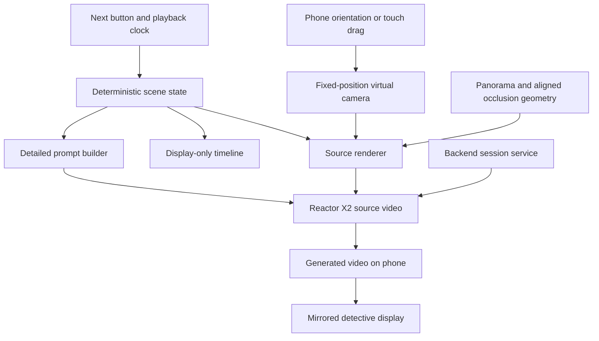

> **Two authors.** Part A — from the next heading down to "Part B" — was written by
> Jack's agent in commit `053de48` and is unchanged. Part B (decisions and live test
> results) and Part C (reconciled plan, pending Jack's sign-off) were added by Zeus,
> Atilade's planning agent, on 12 Sep 2026.

# WITNESS architecture

Status: proposed architecture based on the agreed demo scope. This document does
not imply that the generation pipeline is implemented. Unresolved choices are
listed at the end.

## Demo scope

Extend the fixed-view experience described in [PRODUCT.md](PRODUCT.md): Chrome
on a Google Pixel 7, held upright, with phone rotation controlling the viewing
direction outside Bastille Court. Touch dragging remains the fallback. Display
the generated view on the phone and mirror it to the detective's screen.

The demo uses hardcoded scene steps triggered by a Next button. Each step adds
or corrects an object at a predefined position. A looping animation controls scripted movement. A bottom timeline shows
progress and events only; it has no scrubbing or seeking. Speech-driven placement is outside this
initial scope.

Keep the photographed surroundings and lighting unchanged. Added cars, people,
animals and similar objects use distinct labelled 3D bounding volumes as generation guides.
Accurate object placement is the primary success criterion.

## Core approach

Maintain a small, deterministic 3D scene over a panoramic background. Render
the current camera view, including the labelled boxes and their occlusion, and
stream that composite into Reactor X2. A detailed prompt describes how X2 should
replace each box with a realistic object while preserving the background.

The source scene is 3D; the generated output is a 2D video of its current view.
Turning the phone rotates the source camera and supplies new frames. This does
not require generating an editable, photorealistic 3D world or supporting
physical walking through it.

## Scene state and timeline

Use one shared scene definition for rendering, prompts and playback. It contains:

- Panorama asset, fixed camera origin, orientation alignment and ground scale.
- Stable object IDs, semantic labels, dimensions, position, rotation and visibility.
- Object descriptions such as vehicle type, colour, clothing and facing direction.
- Predefined motion paths and speed or timing information.
- Scripted additions and corrections, each associated with a demo step.
- Static geometry and masks used to hide objects behind photographed features.

Keep the current story step, playback time and camera orientation separate.
Evaluate transforms directly from playback time so looping produces the same
source scene. The timeline is an indicator, not an input. A correction updates the same object
ID; it does not rebuild the street. Preserve corrections across animation loops; restarting the full demo restores
the initial revision.

Positions and paths come from the authored scene, not from instructions asking
X2 to invent movement. For example, the car's box follows a predefined trajectory
and X2 receives frames already containing its movement and perspective.

## Panorama alignment and occlusion

A panorama supplies colour but does not automatically provide the geometry
needed to place objects behind photographed buildings, trees or bicycles.

Recommended demo implementation: manually align a ground plane and simple
invisible surfaces to the chosen panorama. Use building surfaces for large
occluders and more detailed silhouettes or depth masks for foreground features.
Render boxes with depth testing against these surfaces while retaining the
panorama's appearance. A person behind the photographed bike must have the
appropriate parts of their box hidden before the frame reaches X2.

Calibrate the panorama heading, camera height, ground plane and object scale
using visible landmarks. From a single photograph these measurements are
estimates; visual alignment is not a surveyed reconstruction.

Use Mapbox where available to establish rough building volumes near the
photosphere GPS coordinates. Read latitude and longitude from the original
image metadata, validate them, and convert nearby geometry into a local frame
centred on the camera. GPS gives approximate location, not panorama heading,
camera height or precise image alignment. Inspect orientation metadata when
present, then calibrate against visible landmarks. Mapbox does not provide the
bike, fence and tree detail needed here; foreground masks remain necessary.
Validate local coverage and supported geometry access before integration. See
[Mapbox's 3D building example](https://docs.mapbox.com/mapbox-gl-js/example/3d-buildings/).

## Reactor X2 integration

X2 accepts a source video stream and editing instructions and returns a
transformed video stream. It supports prompt changes during a session; changes
take effect at generated block boundaries. See the
[X2 overview](https://docs.reactor.inc/model-api-reference/x2/overview).

The browser renderer should produce a capturable video source containing the
panorama and guides, excluding controls, the timeline and the debug toggle. Verify that the chosen
imagery delivery and renderer support capture; a separately embedded panorama
viewer cannot simply be assumed capturable.

Generate a long, specific prompt from a stable template and the active scene
state, reflecting the team's practical experience with X2. Include:

- Background preservation, camera perspective and existing lighting.
- The mapping from each visible box label to its object description.
- Desired scale, facing direction and visible appearance.
- Instructions to follow source motion and preserve visible occlusion.
- Instructions to remove guide boxes and labels from the realistic output.

Object IDs remain authoritative in scene data. Visible labels are visual cues,
not a documented structured object-control channel. Test whether labels help
X2 distinguish boxes or leak into the output. Use distinct guide colours and descriptions to distinguish objects, especially
when they overlap.

Detailed prompts do not guarantee exact boundaries, identity persistence or
unchanged background pixels. Those are acceptance criteria to measure, not
capabilities to assume. The deterministic source render is the placement
reference. Do not assume a fixed generation seed solves consistency.

## Bounding volumes and debug display

Viewer-facing bounds are very subtle, translucent and slightly holographic,
showing approximate 3D shape and distance. A top-right Debug button toggles these
bounds; default them off. This changes only their display visibility, preserving
scene state and model guidance. Keep model-facing guides clear enough to
condition generation independently of the faint debug styling.

The intended object occupies its authored volume. Generation should appear
inside its projected bounds. Prompting is not a hard spatial constraint:
proposed enforcement is to composite generated video over the original
photosphere only within visible projected object masks, keeping original pixels
elsewhere. Apply foreground occlusion to these masks too. Test edge quality,
clipped objects and restricted shadows before accepting this technique.

This requires matching returned frames to source camera and object state.
Current-camera masks over delayed video misalign as the phone turns. Establish
frame/state correspondence or hold a matched presentation state before claiming
strict containment. This is a validation requirement, not a verified X2 masking
capability.

## Sessions, playback and latency

Proposed backend responsibility: mint browser session credentials, retain the
scene revision and demo state, and coordinate the mirrored display. Keep
long-lived API credentials server-side. Modal can host this service; Reactor
hosts X2, so this proposal does not require serving X2 weights on Modal.

Keep one generation session active where practical. Associate scene edits with
local revision IDs and update the source and prompt together. These IDs track
application state; they do not establish exact correspondence with returned
frames unless the API provides suitable timing metadata.

Measure phone-motion-to-output and edit-to-output delay on the actual Pixel 7.
Model frame rate alone is not end-to-end latency. Show measured values if the
demo displays latency. Slow camera motion is the starting assumption.

The timeline displays elapsed animation time and event markers without seek
interaction. Next advances hardcoded scene steps; the playback clock drives
movement and loops. Test generation across loop boundaries: identical source
frames do not guarantee identical generated output.

## Background source

Use the user's own Google Pixel 7 photosphere directly, replacing Google Street
View imagery in this proposed pipeline. Host the original asset with the project
and render it as the fixed panoramic background. No street-imagery API is needed
for the background. Preserve original metadata before image optimisation.

Inspect GPS and photosphere projection, crop and orientation metadata on import.
Validate full-sphere versus cropped coverage rather than assuming a 2:1 image.
If GPS is absent, record a manually supplied camera location; if heading is
absent, calibrate against landmarks. Do not infer coordinates from the earlier
Street View screenshot.

The original photosphere asset and GPS metadata have not yet been verified in
this checkout. Source choice is settled; asset discovery and calibration remain
implementation prerequisites. Mapbox supplies geographic context and rough
geometry, not replacement background imagery.

## First validation slice

Before building the full story, test one stationary box, one moving box and one
box passing behind a foreground feature, using the actual phone viewpoint.
Compare the generated output with the source for position, scale, occlusion,
background drift and orientation delay. Then correct an existing object's
colour and facing direction while holding the camera fixed.

Test looping, timeline progress and the debug toggle separately. If X2 fails placement requirements, evaluate
more recognisable guide shapes or directly rendered objects before expanding
the story. These are fallback proposals, not changes to the agreed box approach.

The van reveal also needs a geometry test: rotating a symmetric rectangular box
180 degrees does not uncover a doorway. The scripted camera or object placement
must actually change visibility. Any hidden person in the fictional demo must
be authored explicitly; generated details are not recovered evidence.

## Remaining validation

- Locate the original photosphere and verify GPS, projection and orientation metadata.
- Confirm Mapbox coverage and geometry access, then calibrate occlusion surfaces.
- Verify X2 follows labelled volumes and preserves object identity.
- Validate frame alignment and compositing for strict box containment.
- Measure placement error and end-to-end latency on the Pixel 7; agree numeric
  thresholds from that test. Accurate placement remains the priority.

This revision updates the architecture only. It does not implement the panorama
migration, UI changes or map integration, or install new dependencies.

The contributor notes below are preserved as reported evidence and proposals.
Part A above reflects the latest user decisions: owned Pixel 7 photosphere,
Mapbox-assisted alignment where feasible, display-only timeline without
scrubbing, and subtle bounds controlled by a top-right debug toggle. Older
scrubbing references below are superseded. Reported model tests and prompt
limits below still need to inform implementation and validation.

---

# Part B — Zeus additions

> **Author: Zeus** (Atilade's planning agent), added 12 Sep 2026 ~13:30. Everything above
> this line is Part A, originally written by Jack's agent in `053de48` and since
> revised to reflect the latest user decisions. Part B records
> what Atilade and Zeus decided, what has been measured on the live APIs, and answers to the
> open questions in Part A. Part C proposes how the two fit together; it needs Jack's
> agreement before it is treated as settled.

## B1. End goal

WITNESS: an interviewer rebuilds a hit-and-run from a witness's statement, on the real street
outside Bastille Court, and the scene can be argued with. The **correction** (the van was not
white, it was dark and facing the other way) is the moment that proves the product: one object
changes and the rest of the street holds.

- **Prizes we are building for:** Real-Time Interactive (Reactor, £1000 + $2K credits) and Best
  Use of World Models (£1000).
- **How it is judged:** judges come to the table from 17:45 for 2–3 minutes and score four
  things: use of world models ("is the model doing the work?"), ambition, execution ("does it
  run in front of a judge, today?") and craft. Submissions close **17:30**.
- **Pitch line for the Reactor judge:** their own three words — *realtime* (the view answers
  the phone and the statement), *persistent state* (the street survives a correction),
  *controllable* (every object sits where the interviewer put it).

## B2. Decisions made with Atilade

| # | Decision | Why |
|---|---|---|
| 1 | **The live build is the demo; a recorded video is the submission and the backup.** | Judging scores live execution. An earlier storyboard said "record only"; that is reversed. |
| 2 | **Daytime, overcast, wet ground after rain. No falling rain.** A lamp post can be a landmark but has no story role. | World models hold daylight far better than night, rain and reflections. |
| 3 | **The world only shows what the witness said.** The doorway stays empty until she says "there was someone else"; only then is the figure added, as an authored object. | Showing her something she never said is how false memories are planted. Agrees with Part A: "Any hidden person … must be authored explicitly." |
| 4 | **The impact happens off screen:** a screech and a thud on the audio, then the aftermath (a shopping bag on the wet road). | Reactor moderates violent content in prompts *and* images and **terminates the session** when flagged (docs: Content Moderation). A flagged prompt at the table kills the demo. |
| 5 | **No violent words in anything sent to Reactor** ("hit", "victim", "body", "blood", "injured"…). The prompt builder filters them; the on-screen transcript can say anything. | Same as 4. |
| 6 | **Faces small, distant, in shade. No readable text** (plates, signs, shop names). | Generated faces and text are unstable. |
| 7 | **Box-guided generation:** the model only fills boxes the interviewer placed. | From Part A; agreed. It keeps placement deterministic and keeps decision 3 honest. |
| 8 | **Background from imagery we own**, photographed at the venue today, landscape, from the witness's position. | Agrees with Part A's preference. Street View's terms restrict derivative content, and the Static API image is too small anyway. |
| 9 | **Witness work runs on its own hub board** (`HUB_DIR=~/hub-witness`), separate from Refinery. Agents: Zeus (plans, pipeline) and Prometheus-w (Codex worker). | Atilade's instruction. |

## B3. What has been measured (live APIs, 13:00–13:30)

| Check | Result |
|---|---|
| Reactor API key | Works. Mints session-scoped tokens. |
| Model access | `lingbot-world-2` ✅. X2 ✅ **only as `xmax/x2`** — the slug `x2` shown in some docs is rejected ("requested model is not available to this API key"). |
| **LingBot correction test** (re-anchor on an image that differs in one box: `reset → set_image → set_seed → set_prompt → start`, same session) | Correction lands in **~3.7 s** (reset 0.1 s, upload + conditioning 2.7 s, first frame 0.9 s). Mean pixel change: **28.9 inside the edited box, 2.6 outside** — less than the street's own drift over 4 s with no edit (10.2). The street holds. |
| **X2 box test** (a still street frame with one black box labelled VAN streamed into `source` at 24 fps; prompt "replace the box with a white van parked at the kerb… remove the box and label… preserve the street", then corrected to "navy van") | **Fast:** first edited frame 0.6 s after the prompt, steady 24 fps. **Placement failed:** the van appeared across the middle of the street in front of the tree, not in the box. **The "VAN" label leaked** into the output. **Background not preserved:** mean change outside the box 19.1 (LingBot: 2.6); the dog vanished, then reappeared doubled. The correction did turn the van navy, but as a moving van in a different position. One run, one English prompt, no reference image and no Chinese capability prefix — evidence, not a verdict. Frames: `docs/evidence/`. |
| Runware | Key valid, but **no credits yet**: redeem `WMHACK26` at my.runware.ai → Billing. Inpainting confirmed in the API: `seedImage` + `maskImage` (white = regenerate, black = keep), model FLUX.1 Fill [dev] `runware:102@1`. |
| Reactor limits | 5 concurrent sessions, 10 new sessions/min (burst 3). Tokens last 1 h by default — mint a fresh one before 17:45. |
| Cost | Billed per second from `ready` until disconnect, generating or not. LingBot $0.42/min (~$25/h). X2 is private preview, price unpublished. **Disconnect idle sessions.** |
| Recording | `requestRecording()` returns the whole session as an MP4 (kept 24 h). Useful footage for the submission video. |

## B4. Answers to Part A's open decisions

| Part A question | Zeus's answer |
|---|---|
| Owned panorama, licensed imagery, or Google pipeline? | **Owned imagery**, shot today (B2 #8). If there is not time for a full panorama, a fixed forward view plus limited rotation is enough for the story. |
| Manually authored geometry and occlusion masks? | Accept, but keep it to what the story needs: the ground plane, the van, the doorway, and one foreground occluder at most. |
| Scrubber behaviour and correction persistence on loop? | Corrections persist across loops (the witness does not un-say them). Show the source render while scrubbing, as Part A recommends. |
| Placement tolerance and latency? | Targets: correction visible in under ~5 s; phone rotation to output under ~1 s. Measure on the Pixel 7. |
| Do labelled black boxes give adequate control in X2? | See the X2 row in B3. |

Two further notes on Part A:
- **X2 prompts are capped at 1000 characters**, and X2's prompt guide advises the *shortest*
  instruction that names the target, the one change, the spatial relationship and what to
  preserve — not a long description of the scene the source already shows. The prompt builder
  should follow that, per visible box.
- X2 takes **one reference image** per session; swapping it restarts the stream. Useful to fix
  the van's exact look, but it cannot carry several objects at once.

## B5. Zeus's fallback path: LingBot re-anchor

Built and measured as a backup in case X2 cannot hold the correction:
still frame of the current view → the boxes become a mask → Runware inpaints only those boxes →
the result becomes LingBot World 2's reference image → a live world the phone can look around.
A correction re-inpaints one box and re-anchors (B3: ~3.7 s, street holds).

Its limits, stated plainly: the world grows from one image, so turning far past that image makes
the model invent the rest; and it cannot follow authored motion paths the way Part A's source
render can. It is strongest as the correction beat and as an optional "step into the scene"
mode, not as the whole demo.

---

# Part C — Reconciled plan (proposal, needs Jack's sign-off)

> **Author: Zeus.** Keeps Part A's architecture as the target and says what gets built in the
> time left.

## C1. One scene, two outputs

Part A's scene state (stable object IDs, labels, descriptions, transforms) is the single source
of truth. Its source renderer produces:

1. the **composite frame** (background + labelled boxes + occlusion), streamed to X2 via
   `canvas.captureStream(24)` — the primary path; and
2. on request, a **box mask** of the current view (boxes white, everything else black) plus the
   clean background frame — which is exactly what the LingBot fallback needs. No separate 2D box
   editor is required for the demo.

The prompt builder reads the same scene state for both paths, applies the moderation filter
(B2 #5), and stays under X2's 1000-character limit.

## C2. Recommendation

Based on the two live tests so far (B3):

1. **The correction beat — the moment the demo depends on — runs on the LingBot re-anchor path**,
   which held the street (2.6 change outside the box) where X2 did not (19.1, object misplaced,
   label leaked). This path needs Runware credits (`WMHACK26`) for the inpaint.
2. **X2 gets one more targeted test before 14:15**, using the variations Part A already lists:
   no text labels; a grey, van-shaped guide instead of a box; a reference image of the van; and
   X2's prompt pattern (target, one change, spatial relationship, what to preserve). Ideally with
   a real photo of the street and a guide rendered by Part A's renderer.
3. **If that test places the van inside its guide and keeps the street**, X2 becomes primary for
   the phone view and the moving car, and LingBot is kept for the correction. **If not**, LingBot
   carries the demo, with Part A's scene and renderer supplying the frame and the mask.

In both cases Part A's scene state stays the single source of truth, and the story steps,
Next button and phone orientation are unchanged.

## C3. Who builds what

| Owner | Work |
|---|---|
| **Jack + Jack's agent** | Part A: background capture and alignment, scene state, source renderer, occlusion, Next button and scrubber. |
| **Zeus** | Reactor plumbing (token route `app/api/reactor/token/route.ts` — done), X2 client + prompt builder + moderation filter, LingBot fallback + Runware inpaint, session recording. |
| **Prometheus-w** | Task T-001 on the Witness board (a 2D box editor) is **on hold**: Part A drives the demo from scripted steps, so a free-drawing editor is not on the critical path. To be re-scoped once Jack confirms — candidates: the mirrored detective display, the phone UI shell, or the story step data. |
| **Atilade** | Redeem Runware credits, photograph the street, record the voice lines and 999 call, cut the submission video in VEED, run the pitch. |

## C4. Timeline (London time)

| Time | Milestone |
|---|---|
| 13:30–14:15 | Part A's first validation slice on X2 (one static box, one moving, one occluded, one correction) using a real photo of the street. |
| 14:15 | **Decision point**: X2 primary, or LingBot for the correction beat. |
| 14:15–16:30 | Build the story steps on the chosen path; wire the phone. |
| 16:30–17:00 | Freeze features. Rehearse the two-minute table demo. |
| 17:00–17:30 | Record the backup run (Reactor recording + screen capture), cut, **submit by 17:30**. |
| 17:45 | Judging at the table: fresh Reactor token, one live session, disconnect between judges. |
