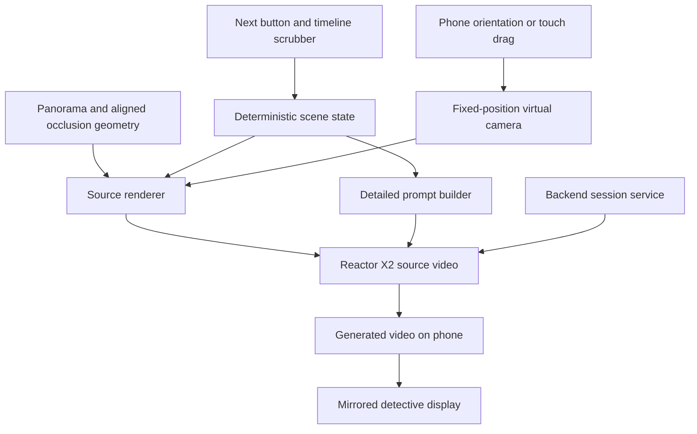

# WITNESS architecture

Status: proposed architecture based on the agreed demo scope. This document does
not imply that the generation pipeline is implemented. Unresolved choices are
listed at the end.

## Demo scope

Extend the fixed-view experience described in [PRODUCT.md](PRODUCT.md): Chrome
on a Google Pixel 7, held upright, with phone rotation controlling the viewing
direction outside Bastille Court. Touch dragging remains the fallback. Display
the generated view on the phone and mirror it to the detective's screen.

The demo uses hardcoded scene steps triggered by a Next button. Each step adds
or corrects an object at a predefined position. A looping timeline and bottom
scrubber control scripted movement. Speech-driven placement is outside this
initial scope.

Keep the photographed surroundings and lighting unchanged. Added cars, people,
animals and similar objects use labelled black 3D boxes as generation guides.
Accurate object placement is the primary success criterion.

## Core approach

Maintain a small, deterministic 3D scene over a panoramic background. Render
the current camera view, including the labelled boxes and their occlusion, and
stream that composite into Reactor X2. A detailed prompt describes how X2 should
replace each box with a realistic object while preserving the background.

The source scene is 3D; the generated output is a 2D video of its current view.
Turning the phone rotates the source camera and supplies new frames. This does
not require generating an editable, photorealistic 3D world or supporting
physical walking through it.

## Scene state and timeline

Use one shared scene definition for rendering, prompts and playback. It contains:

- Panorama asset, fixed camera origin, orientation alignment and ground scale.
- Stable object IDs, semantic labels, dimensions, position, rotation and visibility.
- Object descriptions such as vehicle type, colour, clothing and facing direction.
- Predefined motion paths and speed or timing information.
- Scripted additions and corrections, each associated with a demo step.
- Static geometry and masks used to hide objects behind photographed features.

Keep the current story step, playback time and camera orientation separate.
Evaluate object transforms directly from the selected time so seeking backwards
and looping produce the same source scene. A correction updates the same object
ID; it does not rebuild the street. Define explicitly which corrections persist
when the animation loops.

Positions and paths come from the authored scene, not from instructions asking
X2 to invent movement. For example, the car's box follows a predefined trajectory
and X2 receives frames already containing its movement and perspective.

## Panorama alignment and occlusion

A panorama supplies colour but does not automatically provide the geometry
needed to place objects behind photographed buildings, trees or bicycles.

Recommended demo implementation: manually align a ground plane and simple
invisible surfaces to the chosen panorama. Use building surfaces for large
occluders and more detailed silhouettes or depth masks for foreground features.
Render boxes with depth testing against these surfaces while retaining the
panorama's appearance. A person behind the photographed bike must have the
appropriate parts of their box hidden before the frame reaches X2.

Calibrate the panorama heading, camera height, ground plane and object scale
using visible landmarks. From a single photograph these measurements are
estimates; visual alignment is not a surveyed reconstruction.

Mapbox building extrusions may help establish rough building volumes, but do
not supply the detailed bicycle, fence and tree geometry needed here. Adding
Mapbox is optional and does not remove the alignment work. See the official
[3D buildings example](https://docs.mapbox.com/mapbox-gl-js/example/3d-buildings/).

## Reactor X2 integration

X2 accepts a source video stream and editing instructions and returns a
transformed video stream. It supports prompt changes during a session; changes
take effect at generated block boundaries. See the
[X2 overview](https://docs.reactor.inc/model-api-reference/x2/overview).

The browser renderer should produce a capturable video source containing the
panorama and guides, excluding controls and the scrubber. Verify that the chosen
imagery delivery and renderer support capture; a separately embedded panorama
viewer cannot simply be assumed capturable.

Generate a long, specific prompt from a stable template and the active scene
state, reflecting the team's practical experience with X2. Include:

- Background preservation, camera perspective and existing lighting.
- The mapping from each visible box label to its object description.
- Desired scale, facing direction and visible appearance.
- Instructions to follow source motion and preserve visible occlusion.
- Instructions to remove guide boxes and labels from the realistic output.

Object IDs remain authoritative in scene data. Visible labels are visual cues,
not a documented structured object-control channel. Test whether labels help
X2 distinguish boxes or leak into the output. Identical black boxes can be
ambiguous, particularly when they overlap.

Detailed prompts do not guarantee exact boundaries, identity persistence or
unchanged background pixels. Those are acceptance criteria to measure, not
capabilities to assume. The deterministic source render is the placement
reference. Do not assume a fixed generation seed solves consistency.

## Sessions, playback and latency

Proposed backend responsibility: mint browser session credentials, retain the
scene revision and demo state, and coordinate the mirrored display. Keep
long-lived API credentials server-side. Modal can host this service; Reactor
hosts X2, so this proposal does not require serving X2 weights on Modal.

Keep one generation session active where practical. Associate scene edits with
local revision IDs and update the source and prompt together. These IDs track
application state; they do not establish exact correspondence with returned
frames unless the API provides suitable timing metadata.

Measure phone-motion-to-output and edit-to-output delay on the actual Pixel 7.
Model frame rate alone is not end-to-end latency. Show measured values if the
demo displays latency. Slow camera motion is the starting assumption.

The source timeline can seek immediately. Generated video has temporal state,
so backwards seeking may need regeneration or session recovery and cannot be
assumed to reproduce the earlier output exactly.

Recommended, pending agreement: show the source panorama and boxes while the
scrubber is dragged, then resume generation from the selected time on release.
Prepared generated recordings can provide exact replay only for their recorded
camera paths; they do not cover arbitrary phone viewing directions.

## Background source

The existing experience uses Google Street View. Permission and technical
access to stream that imagery through X2 remain unresolved. Google's published
terms restrict extraction and creating content based on Maps content; do not
assume the existing display integration authorises this transformation pipeline.
See [Google Maps Platform terms](https://cloud.google.com/maps-platform/terms).

Preferred alternative for this one-location demo: capture and host an owned
panorama. The viewer and manually aligned geometry can be constructed around
that asset without a street-imagery API. A single screenshot can support a
limited view but cannot establish accurate unseen surroundings for full rotation.

Mapillary is another candidate: its service is free and its imagery is offered
under CC BY-SA. Check exact-location panorama coverage, applicable service terms,
attribution and adaptation requirements before choosing it. See the
[Mapillary FAQ](https://help.mapillary.com/hc/en-us/articles/8348198426396-Mapillary-FAQ)
and [imagery licence](https://help.mapillary.com/hc/en-us/articles/115001770409-CC-BY-SA-license-for-open-data).
KartaView is an additional coverage-dependent option with imagery adaptation
terms described in its [terms](https://kartaview.org/terms).

## First validation slice

Before building the full story, test one stationary box, one moving box and one
box passing behind a foreground feature, using the actual phone viewpoint.
Compare the generated output with the source for position, scale, occlusion,
background drift and orientation delay. Then correct an existing object's
colour and facing direction while holding the camera fixed.

Test looping and seeking separately. If X2 fails placement requirements, evaluate
more recognisable guide shapes or directly rendered objects before expanding
the story. These are fallback proposals, not changes to the agreed box approach.

The van reveal also needs a geometry test: rotating a symmetric rectangular box
180 degrees does not uncover a doorway. The scripted camera or object placement
must actually change visibility. Any hidden person in the fictional demo must
be authored explicitly; generated details are not recovered evidence.

## Decisions still open

- Owned panorama, licensed alternative imagery, or authorised Google pipeline.
- Acceptance of manually authored geometry and foreground occlusion masks.
- Scrubber behaviour while generation catches up and correction persistence on loops.
- Required placement tolerance and acceptable end-to-end latency.
- Whether labelled black boxes provide adequate control in X2.

No new framework, map provider or generation dependency is selected or installed
by this document. Implementation should extend the existing fixed-view product
after these choices and the initial generation test are resolved.
